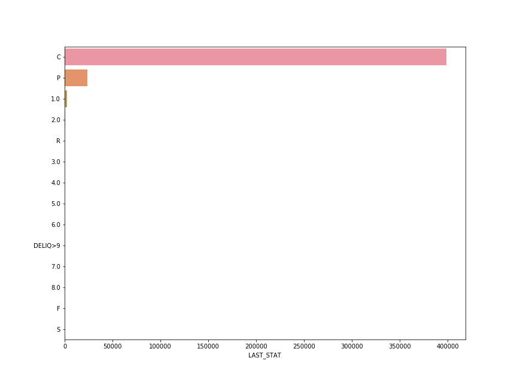
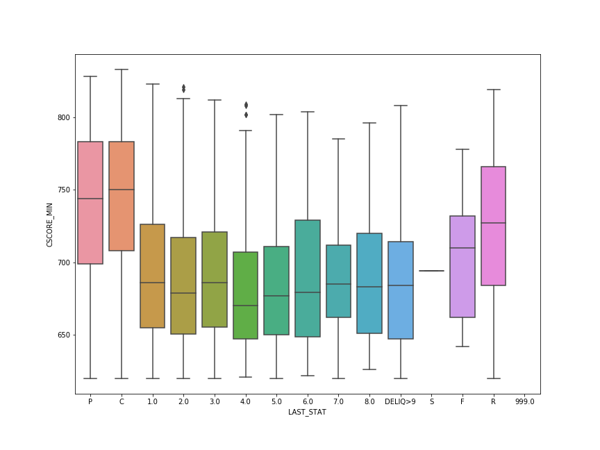
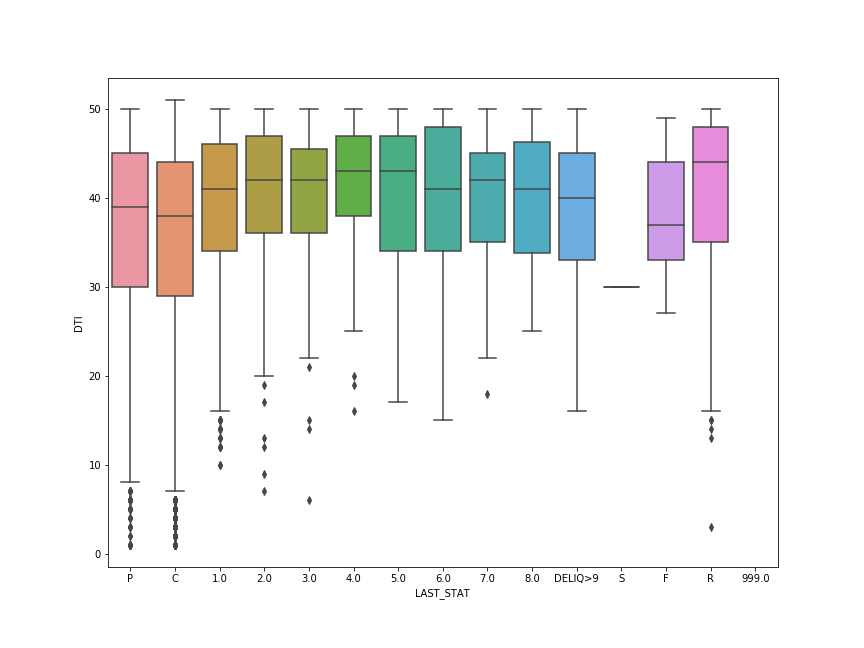

# Analysis Local Instruction

I wrote this small program to help me understand the raw data files in order to develop the schema for the loan level data table. This program runs on your local machine and will generate a thorough report for a specific year or quarter that you downloaded.

In order to run the analysis, specify the path of the four input files: the acquisition file and performance file, and the two Harp data files. Also place the mapping file in the same folder.

For example, below is how I would use the program to analyze the 2018 first quarter loan level data stored in the folder `2018Q1`; my harp input is stored in the folder `HARP_Files`.

```
python processing_local.py -a './2018Q1/Acquisition_2018Q1.txt' -p './2018Q1/Acquisition_2018Q1.txt' -i ''./HARP_Files/Acquisition_HARP.txt' -u './HARP_Files/
Performance_HARP.txt'
```

The program will track down all the available records of every single borrower and aggregate their behavior into one single row within that particular time window that you have on files.

Note that the Harp file is still quite big(17GB), the analysis may take from 30 mins to 1 hour to finish dependes on how many loans fannie and freddie acquired that year.

After the analysis, the program will write out a `report.csv` file to your disk, along with a couple of plots.

Below are the visualization produced by this program for the 2018 first quarter loan level data:


No loans that are aquired at this period have default status yet. Small precentage have prepay status, and a few have delinquency status which is not very concerning. Majority of the loans are healthy.



For loans that are current and active, borrowers tend to have higher than average credit scores. For loans that have delinquency status, borrowers tend to have lower credit scores, especially for loans that have deliquency status more than 3 monts.


This graph shows the loan performance against the borrowers' Debt-to-Income ratio. It may be a better idea not to stretch your income too much in order to be able to make that mortgage payment on time!
