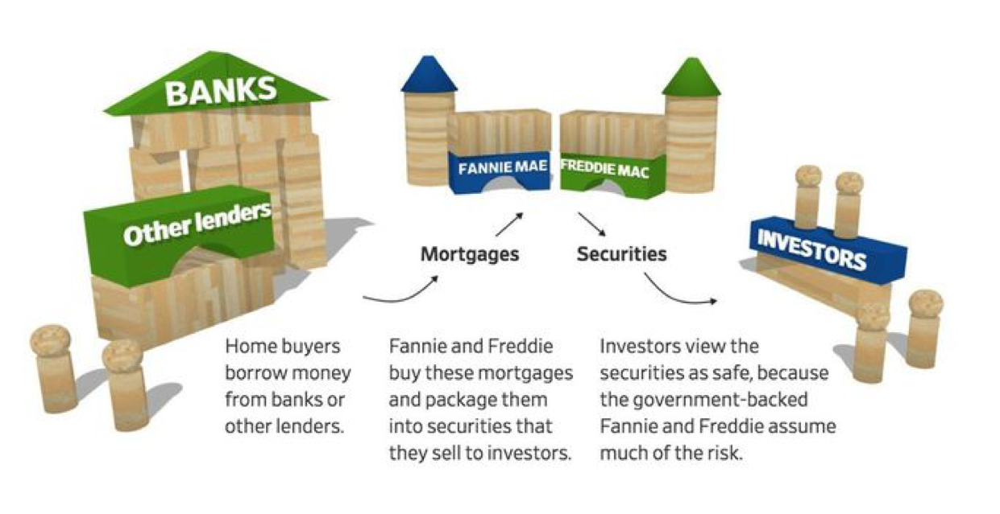
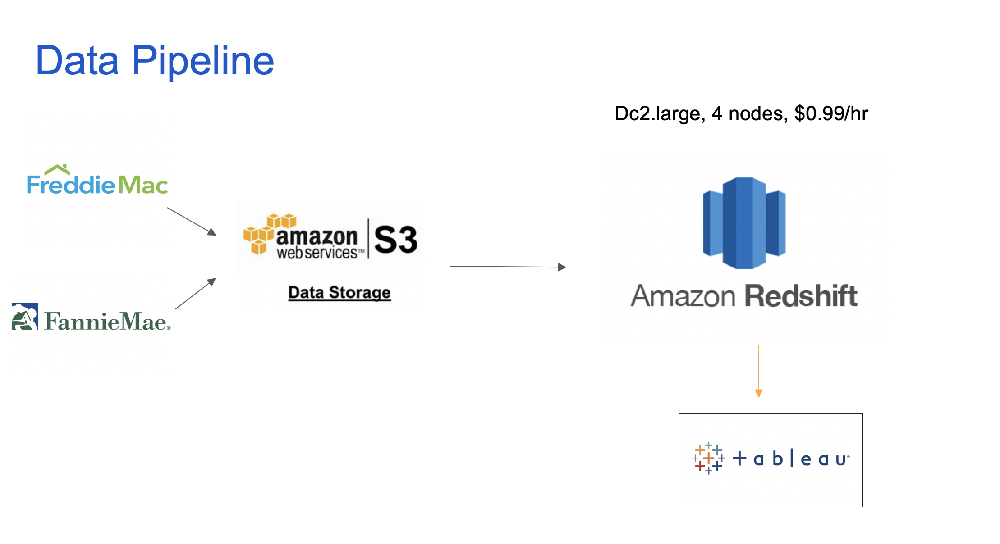

# Project Mortgage

Introduction:
Since the 2008 housing crisis and the massive government bailout, monitoring the healthiness of the current mortgage market is a public concern. Freddie Mac and Fannie Mae are currently the two biggest, government associated entities that acquire and trade housing mortegage as securities. They publish a big subset of their actual acquisitions and their performance throughout the years to provide transparency to the investors, also for anyone who are interested in digging into the nitty gritty details for research and education purpose. However, its big volumn, complicated data structure accross different time periods, coupled with the nature of mortgage loans being such a sophisticated financial product make it very difficult to generate any immeciate insight.

In this distributing data warehouse project, I used S3 as my data lake to pull in the entirety of these public data sets over 300 GB, then use AWS Redshift to structure a couple of master tables detailing each loan's origination and their performance through out their life cyle. The end result is a relational database that is easy and fast to query.

[presentation](url)

## The required technologies:
1. S3
2. EC2
2. Redshift
3. Python

## Architecture

## What you will find available in this repo

## Data
Data are downloandable at
* Freddie Mac: http://www.freddiemac.com/research/datasets/sf_loanlevel_dataset.page
* Fannie Mae:
https://www.fanniemae.com/portal/funding-the-market/data/loan-performance-data.html

Note both websites required registration.

## Trade-offsS
AWS redshift is not an free tier available option. But the distributing processing power is an ideal choice for this project which facilate paralled write and fast queries.
